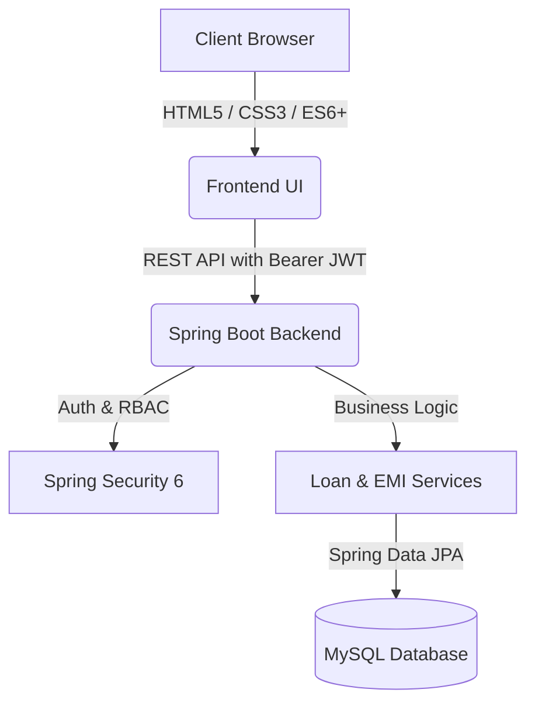

<div align="center">

# 💳 CrediTrack
### Modern Digital Loan Origination & Repayment Platform

[](https://spring.io/projects/spring-boot)
[](https://www.oracle.com/java/)
[](https://www.mysql.com/)
[](https://jwt.io/)
[](LICENSE)

<p align="center">
  <b>A lightweight, secure, and intuitive platform for instant loan calculation, role-based origination, and automated EMI schedule tracking.</b>
</p>

---

</div>

## ✨ Highlights

- ⚡ **Interactive EMI Simulator** — Real-time sliders to calculate monthly installments and interest before applying.
- 🛡️ **Role-Based Security** — Distinct portals and capabilities for **Customers**, **Loan Officers**, and **Admins**.
- 🧮 **Automated Amortization Engine** — Instant generation of monthly installment schedules upon loan approval.
- 🔄 **Auto-Closure Tracking** — Seamless payment processing with automatic loan status closure when all EMIs are settled.
- 🎨 **Sleek, Responsive UI** — Clean, modern dashboard built with zero heavy frontend build requirements.

---

## 🏛️ Architecture Overview



---

## ⚡ Quick Start

### 1. Prerequisites
- **Java 17+**
- **Maven 3.8+**
- **MySQL 8.0+**

### 2. Environment Configuration
Copy the example environment file and add your own local credentials:

```bash
cp .env.example .env
```

Configure your local `.env` file (kept private & git-ignored):
```env
DB_URL=jdbc:mysql://localhost:3306/creditrack?createDatabaseIfNotExist=true&useSSL=false&allowPublicKeyRetrieval=true
DB_USERNAME=your_mysql_username
DB_PASSWORD=your_mysql_password

JWT_SECRET=your_secure_256bit_secret_key
JWT_EXPIRATION=86400000
```

### 3. Run Backend
```bash
mvn spring-boot:run
```
> The API server boots up at `http://localhost:8080`

### 4. Run Frontend
Open `frontend/index.html` in your browser or run a lightweight local server:
```bash
# Using Python
python -m http.server 3000 --directory frontend

# Or using Node.js
npx serve frontend
```

---

## 👥 User Roles & Capabilities

| Feature | Customer | Loan Officer | Admin |
| :--- | :---: | :---: | :---: |
| Use Interactive EMI Calculator | ✅ | ✅ | ✅ |
| Submit Loan Application | ✅ | ❌ | ❌ |
| View Personal Loans & EMI Schedules | ✅ | ❌ | ❌ |
| Make Monthly EMI Repayments | ✅ | ❌ | ❌ |
| Review All Submitted Applications | ❌ | ✅ | ✅ |
| Approve / Reject Loan Applications | ❌ | ✅ | ✅ |
| System Health & Management | ❌ | ❌ | ✅ |

---

## 🔌 API Reference

<details>
<summary><b>Click to expand REST API Endpoints</b></summary>

<br>

### 🔐 Authentication (`/api/auth`)
- `POST /api/auth/register` — Create a new customer or staff account
- `POST /api/auth/login` — Sign in and receive Bearer JWT token

### 📋 Loans (`/api/loans`)
- `POST /api/loans/apply` — Apply for a new loan *(Customer)*
- `GET /api/loans/my-loans` — List current user's loans *(Customer)*
- `GET /api/loans` — View all system loans *(Officer / Admin)*
- `GET /api/loans/{id}` — Get single loan details *(Owner / Staff)*
- `PUT /api/loans/{id}/approve` — Approve loan & generate EMI table *(Officer / Admin)*
- `PUT /api/loans/{id}/reject` — Reject loan application *(Officer / Admin)*

### 💳 Repayments & EMIs (`/api/repayment`)
- `GET /api/repayment/loan/{loanId}` — Fetch EMI schedule for a loan
- `POST /api/repayment/pay/{emiId}` — Pay installment & trigger auto-closure *(Customer)*

### 🩺 System
- `GET /api/health` — Service health check & status

</details>

---

## 📂 Project Structure

<details>
<summary><b>Click to view repository layout</b></summary>

```text
CrediTrack/
├── src/main/java/com/creditrack/
│   ├── config/          # Security, JWT Filter, CORS
│   ├── controller/      # Auth, Loan, and Repayment REST endpoints
│   ├── dto/             # Request & Response payloads
│   ├── exception/       # Error handling
│   ├── model/           # User, Loan, EMI entities & enums
│   ├── repository/      # Spring Data JPA repositories
│   └── service/         # Core business logic & calculations
├── src/main/resources/  # Application properties & configs
└── frontend/
    ├── index.html       # Sign In & Sign Up portal
    ├── dashboard.html   # Unified interactive user dashboard
    ├── css/style.css    # Modern UI styles & theme
    └── js/app.js        # API connector & dynamic views
```

</details>

---

## 🛡️ Security & Privacy
- **Zero Exposed Secrets**: All sensitive keys, tokens, and database passwords are kept in local `.env` files and strictly excluded from version control.
- **Stateless Tokens**: Secure HMAC-SHA256 signature verification on every incoming request.
- **Safe Registration**: Self-elevation to administrative privileges during public registration is strictly disallowed.

---

<div align="center">
  <sub>Built with ❤️ for simple, transparent, and modern digital lending.</sub>
</div>
